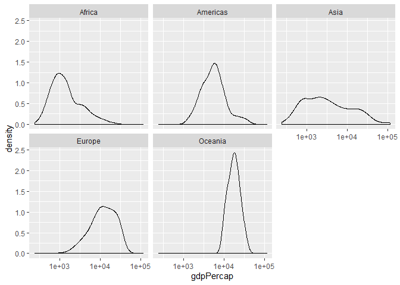

    

    

# Exercise 1: Basic dplyr
*Use dplyr functions to achieve the following.*

### 1.1 Use filter() to subset the gapminder data to three countries of your choice in the 1970’s.
Here I chose Japan, Taiwan and China these three countries

```
## # A tibble: 6 x 6
##   country continent  year lifeExp       pop gdpPercap
##   <fct>   <fct>     <int>   <dbl>     <int>     <dbl>
## 1 Germany Europe     1972    71    78717088    18016.
## 2 Germany Europe     1977    72.5  78160773    20513.
## 3 Japan   Asia       1972    73.4 107188273    14779.
## 4 Japan   Asia       1977    75.4 113872473    16610.
## 5 Taiwan  Asia       1972    69.4  15226039     4063.
## 6 Taiwan  Asia       1977    70.6  16785196     5597.
```
### 1.2 Use the pipe operator %>% to select “country” and “gdpPercap” from your filtered dataset in 1.1.

```
## # A tibble: 36 x 2
##    country gdpPercap
##    <fct>       <dbl>
##  1 Germany     7144.
##  2 Germany    10188.
##  3 Germany    12902.
##  4 Germany    14746.
##  5 Germany    18016.
##  6 Germany    20513.
##  7 Germany    22032.
##  8 Germany    24639.
##  9 Germany    26505.
## 10 Germany    27789.
## # ... with 26 more rows
```
### 1.3 Filter gapminder to all entries that have experienced a drop in life expectancy. Be sure to include a new variable that’s the increase in life expectancy in your tibble. Hint: you might find the lag() or diff() functions useful.

```
## # A tibble: 102 x 7
## # Groups:   country [52]
##    country         continent  year lifeExp       pop gdpPercap difference
##    <fct>           <fct>     <int>   <dbl>     <int>     <dbl>      <dbl>
##  1 China           Asia       1962    44.5 665770000      488.    -6.05  
##  2 Cambodia        Asia       1972    40.3   7450606      422.    -5.10  
##  3 Czech Republic  Europe     1972    70.3   9862158    13108.    -0.0900
##  4 Netherlands     Europe     1972    73.8  13329874    18795.    -0.0700
##  5 Slovak Republic Europe     1972    70.4   4593433     9674.    -0.63  
##  6 Bulgaria        Europe     1977    70.8   8797022     7612.    -0.09  
##  7 Cambodia        Asia       1977    31.2   6978607      525.    -9.10  
##  8 El Salvador     Americas   1977    56.7   4282586     5139.    -1.51  
##  9 Poland          Europe     1977    70.7  34621254     9508.    -0.180 
## 10 Uganda          Africa     1977    50.4  11457758      844.    -0.666 
## # ... with 92 more rows
```
### 1.4 Filter gapminder so that it shows the max GDP per capita experienced by each country.

```
## # A tibble: 142 x 2
##    country     max_gdpPercap
##    <fct>               <dbl>
##  1 Afghanistan          978.
##  2 Albania             5937.
##  3 Algeria             6223.
##  4 Angola              5523.
##  5 Argentina          12779.
##  6 Australia          34435.
##  7 Austria            36126.
##  8 Bahrain            29796.
##  9 Bangladesh          1391.
## 10 Belgium            33693.
## # ... with 132 more rows
```


### 1.5 Produce a scatterplot of Canada’s life expectancy vs. GDP per capita using ggplot2, without defining a new variable. That is, after filtering the gapminder data set, pipe it directly into the ggplot() function. Ensure GDP per capita is on a log scale.
<!-- -->


# Exercise 2:Explore individual variables with dplyr
Pick one categorical variable and one quantitative variable to explore. Answer the following questions in whichever way you think is appropriate, using dplyr:

The categorical variable I picked is `Continent`
The quantitative variable I would like to explore is `gdpPercap`


###  What are possible values (or range, whichever is appropriate) of each variable?

The possible varlues of the categorical `continent` is:

```
## # A tibble: 5 x 1
##   continent
##   <fct>    
## 1 Asia     
## 2 Europe   
## 3 Africa   
## 4 Americas 
## 5 Oceania
```


### What values are typical? What’s the spread? What’s the distribution? Etc., tailored to the variable at hand.


```
## # A tibble: 5 x 5
##   continent `min(gdpPercap)` `max(gdpPercap)` `mean(gdpPercap~
##   <fct>                <dbl>            <dbl>            <dbl>
## 1 Africa                241.           21951.            2194.
## 2 Americas             1202.           42952.            7136.
## 3 Asia                  331           113523.            7902.
## 4 Europe                974.           49357.           14469.
## 5 Oceania             10040.           34435.           18622.
## # ... with 1 more variable: `sd(gdpPercap)` <dbl>
```


The distribution of the gdpPercap of each continent
<!-- -->


# Exercise 3: Explore various plot types 
Make two plots that have some value to them. That is, plots that someone might actually consider making for an analysis. Just don’t make the same plots we made in class – feel free to use a data set from the datasets R package if you wish.

### 1. A scatterplot of two quantitative variables.

<!-- -->

### 2. One other plot besides a scatterplot.

<!-- -->

## Recycling (Optional) (extra 2%)
For people who want to take things further.

Evaluate this code and describe the result. Presumably the analyst’s intent was to get the data for Rwanda and Afghanistan. Did they succeed? Why or why not? If not, what is the correct way to do this?


```r
filter(gapminder, country == c("Rwanda", "Afghanistan"))
```

```
## # A tibble: 12 x 6
##    country     continent  year lifeExp      pop gdpPercap
##    <fct>       <fct>     <int>   <dbl>    <int>     <dbl>
##  1 Afghanistan Asia       1957    30.3  9240934      821.
##  2 Afghanistan Asia       1967    34.0 11537966      836.
##  3 Afghanistan Asia       1977    38.4 14880372      786.
##  4 Afghanistan Asia       1987    40.8 13867957      852.
##  5 Afghanistan Asia       1997    41.8 22227415      635.
##  6 Afghanistan Asia       2007    43.8 31889923      975.
##  7 Rwanda      Africa     1952    40    2534927      493.
##  8 Rwanda      Africa     1962    43    3051242      597.
##  9 Rwanda      Africa     1972    44.6  3992121      591.
## 10 Rwanda      Africa     1982    46.2  5507565      882.
## 11 Rwanda      Africa     1992    23.6  7290203      737.
## 12 Rwanda      Africa     2002    43.4  7852401      786.
```


```r
gapminder %>% 
filter(country == "Rwanda" |country ==  "Afghanistan")
```

```
## # A tibble: 24 x 6
##    country     continent  year lifeExp      pop gdpPercap
##    <fct>       <fct>     <int>   <dbl>    <int>     <dbl>
##  1 Afghanistan Asia       1952    28.8  8425333      779.
##  2 Afghanistan Asia       1957    30.3  9240934      821.
##  3 Afghanistan Asia       1962    32.0 10267083      853.
##  4 Afghanistan Asia       1967    34.0 11537966      836.
##  5 Afghanistan Asia       1972    36.1 13079460      740.
##  6 Afghanistan Asia       1977    38.4 14880372      786.
##  7 Afghanistan Asia       1982    39.9 12881816      978.
##  8 Afghanistan Asia       1987    40.8 13867957      852.
##  9 Afghanistan Asia       1992    41.7 16317921      649.
## 10 Afghanistan Asia       1997    41.8 22227415      635.
## # ... with 14 more rows
```

From the comparison above we can see that they did NOT succeed to get all the data of Rwanda and Afghanistan. It's because first one only list out the data which 'country == c("Rwanda", "Afghanistan")'. The correct one lists out all the data which country equal to Rwanda or Afghanistan.

## Tibble display (Optional) (extra 1%)
Present numerical tables in a more attractive form using `knitr::kable()` for small tibbles (say, up to 10 rows),


```r
gapminder %>%
  filter(country == "Rwanda" |country ==  "Afghanistan") %>% 
  top_n(10) %>% 
  knitr::kable()
```

```
## Selecting by gdpPercap
```


country       continent    year   lifeExp        pop   gdpPercap
------------  ----------  -----  --------  ---------  ----------
Afghanistan   Asia         1957    30.332    9240934    820.8530
Afghanistan   Asia         1962    31.997   10267083    853.1007
Afghanistan   Asia         1967    34.020   11537966    836.1971
Afghanistan   Asia         1977    38.438   14880372    786.1134
Afghanistan   Asia         1982    39.854   12881816    978.0114
Afghanistan   Asia         1987    40.822   13867957    852.3959
Afghanistan   Asia         2007    43.828   31889923    974.5803
Rwanda        Africa       1982    46.218    5507565    881.5706
Rwanda        Africa       1987    44.020    6349365    847.9912
Rwanda        Africa       2007    46.242    8860588    863.0885

and `DT::datatable()` for larger tibbles.


```r
gapminder %>%
  filter(country == "Rwanda" |country ==  "Afghanistan") %>% 
  DT::datatable()
```

<!--html_preserve--><div id="htmlwidget-7d97415259e267ea56ab" style="width:100%;height:auto;" class="datatables html-widget"></div>
<script type="application/json" data-for="htmlwidget-7d97415259e267ea56ab">{"x":{"filter":"none","data":[["1","2","3","4","5","6","7","8","9","10","11","12","13","14","15","16","17","18","19","20","21","22","23","24"],["Afghanistan","Afghanistan","Afghanistan","Afghanistan","Afghanistan","Afghanistan","Afghanistan","Afghanistan","Afghanistan","Afghanistan","Afghanistan","Afghanistan","Rwanda","Rwanda","Rwanda","Rwanda","Rwanda","Rwanda","Rwanda","Rwanda","Rwanda","Rwanda","Rwanda","Rwanda"],["Asia","Asia","Asia","Asia","Asia","Asia","Asia","Asia","Asia","Asia","Asia","Asia","Africa","Africa","Africa","Africa","Africa","Africa","Africa","Africa","Africa","Africa","Africa","Africa"],[1952,1957,1962,1967,1972,1977,1982,1987,1992,1997,2002,2007,1952,1957,1962,1967,1972,1977,1982,1987,1992,1997,2002,2007],[28.801,30.332,31.997,34.02,36.088,38.438,39.854,40.822,41.674,41.763,42.129,43.828,40,41.5,43,44.1,44.6,45,46.218,44.02,23.599,36.087,43.413,46.242],[8425333,9240934,10267083,11537966,13079460,14880372,12881816,13867957,16317921,22227415,25268405,31889923,2534927,2822082,3051242,3451079,3992121,4657072,5507565,6349365,7290203,7212583,7852401,8860588],[779.4453145,820.8530296,853.10071,836.1971382,739.9811058,786.11336,978.0114388,852.3959448,649.3413952,635.341351,726.7340548,974.5803384,493.3238752,540.2893983,597.4730727,510.9637142,590.5806638,670.0806011,881.5706467,847.991217,737.0685949,589.9445051,785.6537648,863.0884639]],"container":"<table class=\"display\">\n  <thead>\n    <tr>\n      <th> <\/th>\n      <th>country<\/th>\n      <th>continent<\/th>\n      <th>year<\/th>\n      <th>lifeExp<\/th>\n      <th>pop<\/th>\n      <th>gdpPercap<\/th>\n    <\/tr>\n  <\/thead>\n<\/table>","options":{"columnDefs":[{"className":"dt-right","targets":[3,4,5,6]},{"orderable":false,"targets":0}],"order":[],"autoWidth":false,"orderClasses":false}},"evals":[],"jsHooks":[]}</script><!--/html_preserve-->

