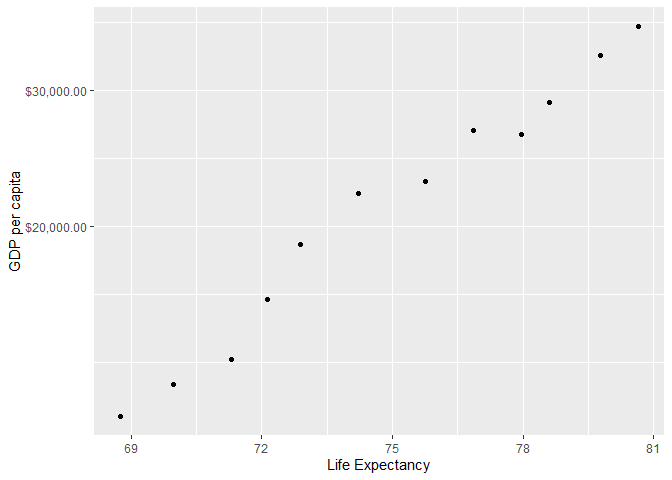

<!---The following chunk allows errors when knitting--->


    

```r
# load your packages here:
library(gapminder)
library(tidyverse)
```
    

## Exercise 1: Basic dplyr
*Use dplyr functions to achieve the following.*

### 1.1 Use filter() to subset the gapminder data to three countries of your choice in the 1970’s.
Here I chose Japan, Taiwan and China these three countries

```
## # A tibble: 36 x 6
##    country continent  year lifeExp      pop gdpPercap
##    <fct>   <fct>     <int>   <dbl>    <int>     <dbl>
##  1 Germany Europe     1952    67.5 69145952     7144.
##  2 Germany Europe     1957    69.1 71019069    10188.
##  3 Germany Europe     1962    70.3 73739117    12902.
##  4 Germany Europe     1967    70.8 76368453    14746.
##  5 Germany Europe     1972    71   78717088    18016.
##  6 Germany Europe     1977    72.5 78160773    20513.
##  7 Germany Europe     1982    73.8 78335266    22032.
##  8 Germany Europe     1987    74.8 77718298    24639.
##  9 Germany Europe     1992    76.1 80597764    26505.
## 10 Germany Europe     1997    77.3 82011073    27789.
## # ... with 26 more rows
```
### 1.2 Use the pipe operator %>% to select “country” and “gdpPercap” from your filtered dataset in 1.1.

```
## # A tibble: 36 x 2
##    country gdpPercap
##    <fct>       <dbl>
##  1 Germany     7144.
##  2 Germany    10188.
##  3 Germany    12902.
##  4 Germany    14746.
##  5 Germany    18016.
##  6 Germany    20513.
##  7 Germany    22032.
##  8 Germany    24639.
##  9 Germany    26505.
## 10 Germany    27789.
## # ... with 26 more rows
```
### !!!!!1.3 Filter gapminder to all entries that have experienced a drop in life expectancy. Be sure to include a new variable that’s the increase in life expectancy in your tibble. Hint: you might find the lag() or diff() functions useful.

```
## # A tibble: 102 x 7
## # Groups:   country [52]
##    country         continent  year lifeExp       pop gdpPercap difference
##    <fct>           <fct>     <int>   <dbl>     <int>     <dbl>      <dbl>
##  1 China           Asia       1962    44.5 665770000      488.    -6.05  
##  2 Cambodia        Asia       1972    40.3   7450606      422.    -5.10  
##  3 Czech Republic  Europe     1972    70.3   9862158    13108.    -0.0900
##  4 Netherlands     Europe     1972    73.8  13329874    18795.    -0.0700
##  5 Slovak Republic Europe     1972    70.4   4593433     9674.    -0.63  
##  6 Bulgaria        Europe     1977    70.8   8797022     7612.    -0.09  
##  7 Cambodia        Asia       1977    31.2   6978607      525.    -9.10  
##  8 El Salvador     Americas   1977    56.7   4282586     5139.    -1.51  
##  9 Poland          Europe     1977    70.7  34621254     9508.    -0.180 
## 10 Uganda          Africa     1977    50.4  11457758      844.    -0.666 
## # ... with 92 more rows
```
### 1.4 Filter gapminder so that it shows the max GDP per capita experienced by each country.

```
## # A tibble: 142 x 2
##    country     max_gdpPercap
##    <fct>               <dbl>
##  1 Afghanistan          978.
##  2 Albania             5937.
##  3 Algeria             6223.
##  4 Angola              5523.
##  5 Argentina          12779.
##  6 Australia          34435.
##  7 Austria            36126.
##  8 Bahrain            29796.
##  9 Bangladesh          1391.
## 10 Belgium            33693.
## # ... with 132 more rows
```


### 1.5 Produce a scatterplot of Canada’s life expectancy vs. GDP per capita using ggplot2, without defining a new variable. That is, after filtering the gapminder data set, pipe it directly into the ggplot() function. Ensure GDP per capita is on a log scale.
<!-- -->


## Exercise 2:Explore individual variables with dplyr
Pick one categorical variable and one quantitative variable to explore. Answer the following questions in whichever way you think is appropriate, using dplyr:

* What are possible values (or range, whichever is appropriate) of each variable?
* What values are typical? What’s the spread? What’s the distribution? Etc., tailored to the variable at hand.
* Feel free to use summary stats, tables, figures.


## Exercise 3: Explore various plot types 
Make two plots that have some value to them. That is, plots that someone might actually consider making for an analysis. Just don’t make the same plots we made in class – feel free to use a data set from the datasets R package if you wish.

1. A scatterplot of two quantitative variables.

```r
ggplot(gapminder %>% 
         filter(country == 'Taiwan'), aes(lifeExp, pop)) +
  geom_point()
```

<!-- -->

2. One other plot besides a scatterplot.


## Recycling (Optional) (extra 2%)
For people who want to take things further.

Evaluate this code and describe the result. Presumably the analyst’s intent was to get the data for Rwanda and Afghanistan. Did they succeed? Why or why not? If not, what is the correct way to do this?

`filter(gapminder, country == c("Rwanda", "Afghanistan"))`


## Tibble display (Optional) (extra 1%)
Present numerical tables in a more attractive form using `knitr::kable()` for small tibbles (say, up to 10 rows), and `DT::datatable()` for larger tibbles.
