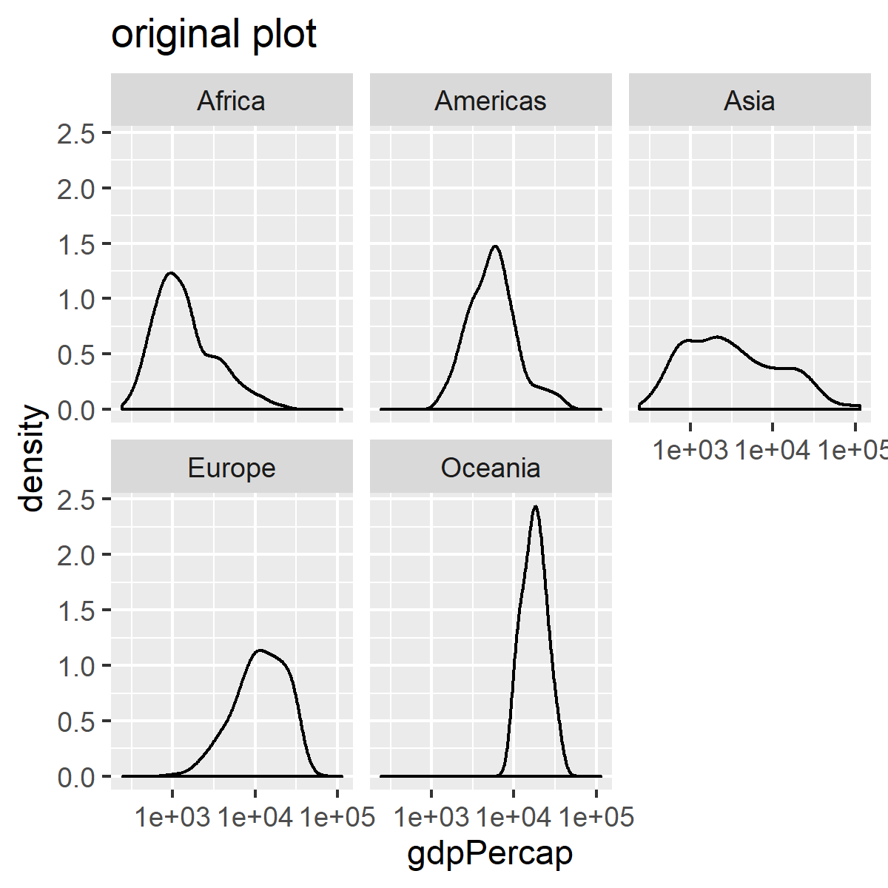
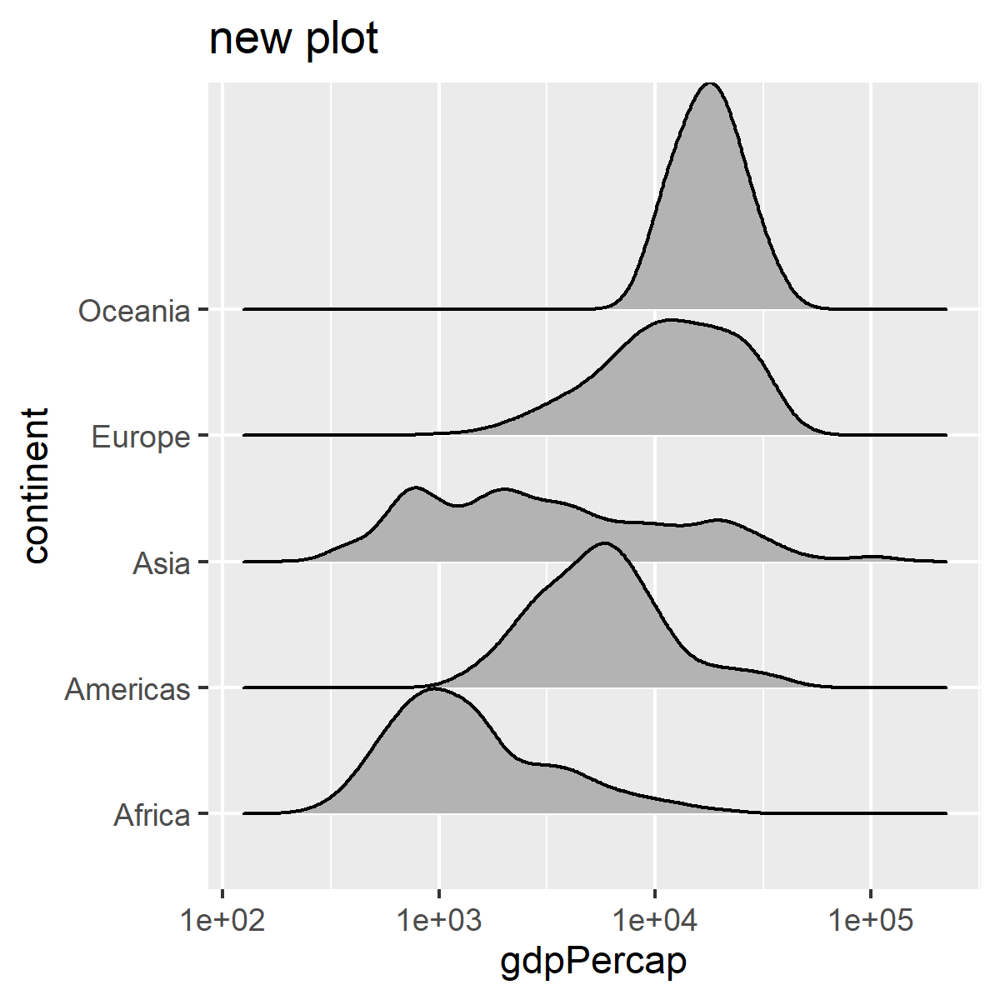

```{r , warning=FALSE,echo=FALSE}
suppressPackageStartupMessages(library(tidyverse)) 
suppressPackageStartupMessages(library(gapminder))
suppressPackageStartupMessages(library(knitr))
suppressPackageStartupMessages(library(forcats))
suppressPackageStartupMessages(library(ggplot2))
suppressPackageStartupMessages(library(here))
```


# Exercise 1:Explain the value of the here::here package

### Read through the [blog post by Malcolm Barrett](https://malco.io/2018/11/05/why-should-i-use-the-here-package-when-i-m-already-using-projects/) where he outlines why one should use the here::here package in RStudio projects.

The here::here makes the code more robust and easier for others to open. It is not practical to start the code with setwd() to specify the working directory since the directory depends on the devices and operating systems. The here::here package solve the problem to find the working directory and avoid the need to manually specify a working directory. 
Moreover, it use ", " to separate each subdirectory instead of "\" in windows or "/" in Mac OS. It makes the code reproducible.
The other reason why one should use the here::here is that the R Markdown documents sets a local working directory. In order to read the .Rmd, one needs backtracking such as ../folder/file.Rmd. Using here("folder","file.Rmd") can solve this problem.
Therefore, here package provides a platform-independent and sipmlier way for coding.


# Exercise 2: Factor management

For exercise 2, I will stick to the gapminder as my dataset and `continent` as the variable for the factor management.

Let's take a look at the `continent`:

```{r}
class(gapminder$continent)
```

```{r}
levels(gapminder$continent)
```
We can see that `continent` is indeed a factor that have five levels.

### 1. Drop factor / levels;

To drop all the data of the Oceania from the gapminder, We can use `filter()` and drop the unused levesl by `droplevels()`:

```{r}
filtered_gapminder<- gapminder %>% 
  filter(continent != "Oceania") %>% 
  droplevels()

DT::datatable(filtered_gapminder)
```


So, we can see we only have 4 levels now.
```{r}
levels(filtered_gapminder$continent)
```

The number of the row before dropping is:
```{r}
nrow(gapminder)
```
After dropping is:
```{r}
nrow(filtered_gapminder)
```

### 2. Reorder levels based on knowledge from data.

Let's see the plot of average life expectancy for each continent.
```{r}
unreordered <- gapminder %>%
  group_by(continent) %>%
  summarise(mean_lifeExp = mean(lifeExp)) %>%
  ggplot() +
  geom_col(aes(continent,mean_lifeExp)) +
  ylab("Mean of\nLife Expectancy") +
  xlab("Continent") +
  coord_flip() +
  ggtitle("Unreordered")

unreordered 
```

Before we reorder the levels, it's alphabetical order by default. If we want to reorder the levels of `continent` in the plot to have the longer mean life expectancy on the top and shorter mean life expectancy on the bottom, we can use `fct_reorder()`:

```{r}
reordered <- gapminder %>%
  group_by(continent) %>%
  summarise(mean_lifeExp = mean(lifeExp)) %>%
  ggplot() +
  geom_col(aes(fct_reorder(continent,mean_lifeExp),mean_lifeExp)) +
  ylab("Mean of\nLife Expectancy") +
  xlab("Continent") +
  coord_flip() +
  ggtitle("Reordered")

reordered
```


# Exercise 3: File input/output (I/O)

#### Task: Experiment with at least one of:
* ####  write_csv()/read_csv() (and/or TSV friends),
* #### saveRDS()/readRDS(),
* #### dput()/dget().

#### You are expected to create something new, probably by filtering or grouped-summarization of your dataset (for e.g., Singer, Gapminder, or another dataset), export it to disk and then reload it back in using one of the packages above. You should use here::here() for reading in and writing out. With the imported data, play around with factor levels and use factors to order your data with one of your factors (i.e. non-alphabetically). For the I/O method(s) you chose, comment on whether or not your newly created file survived the round trip of writing to file then reading back in.

Here I am going to create a new dataset that has the mean life expectancy of all the countries in Asia and reorder by the mean life expectancy:
```{r}
something_new <- gapminder %>%
  filter(continent == "Asia") %>%
  group_by(country) %>%
  mutate(mean_lifeExp = mean(lifeExp)) %>%
  arrange(mean_lifeExp) %>% 
  select(country, continent, mean_lifeExp) %>%
  distinct()

DT::datatable(something_new)
```

Here we use `here::here` to increase robustness and export the file to the HW_05 folder

```{r}
write_csv(something_new, here::here("HW_05","something_new.csv"))
```

Let's reload the something_new file back:

```{r}
reload_gap <- read_csv(here::here("HW_05","something_new.csv"))
DT::datatable(reload_gap)
```


Here I use `write_csv()` and `read_csv()` function and the read-back file is exact the same as the write-in file. 

# Exercise 4: Visualization design
####  Task: Create a side-by-side plot and juxtapose your first attempt (show the original figure as-is) with a revised attempt after some time spent working on it and implementing principles of effective plotting principles. Comment and reflect on the differences.


```{r}
original <- gapminder %>% 
  ggplot(aes(x=gdpPercap))+ 
  geom_density()+ #Plot density
  scale_x_log10()+
  facet_wrap(~continent)+ #plot the density side by side
  ggtitle("original plot")

new <- gapminder %>% 
  ggplot(aes(x=gdpPercap, y = continent))+ 
  scale_x_log10()+
  ggridges::geom_density_ridges()+
    ggtitle("new plot")

cowplot::plot_grid(original, new, 
          ncol = 1, nrow = 2)
```

In the upper plot(original), the gdp per capita distribution for each continent is depicted separatedly in its own. It is not intuitive to compare the plot of each continent in different plots since the readers need to check whether the x axis of each plots are the same. The new version (bottom) put all the plots into the same one. So the readers can intuitively know the distribution of the gdp per capita for each continent by a glimpse.


# Exercise 5: Writing figures to file
#### Task: Use <span style="color:red">ggsave()</span> to explicitly save a plot to file. Include the exported plot as part of your repository and assignment.


```{r}
ggsave(here::here("HW_05","gdpPercap_each_continent_new.png"), plot = new, width = 4, height = 4, scale = 1)
ggsave(here::here("HW_05","gdpPercap_each_continent_original.png"), plot = original, width = 4, height = 4, scale = 1)
```

#### Then, use <span style="color:red">![Alt text] (/path/to/img.png) </span> to load and embed that file into your report. You can play around with various options, such as:

`  `

` `




